# A Kayakers Guide To The French Alps

The kayakers guide to the French Alps aims to inform and guide users who are looking to paddle abroad; more specifically in the French Alps. It aims to be responsive across a range of viewing devices.

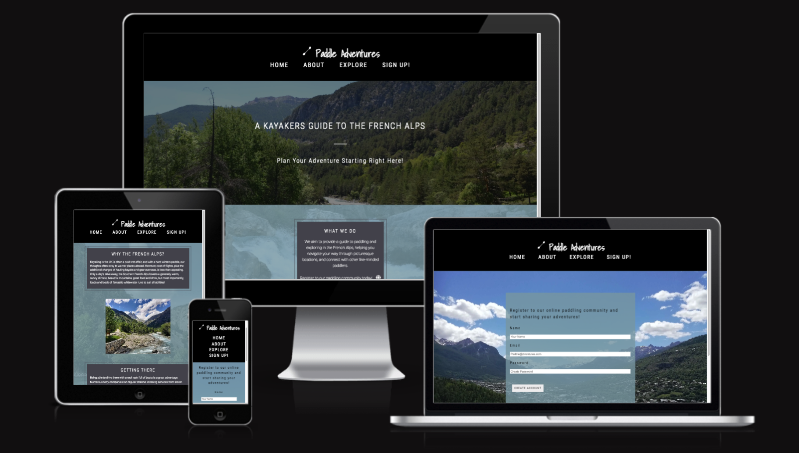

[View A Kayakers Guide To The French Alps on Github](https://github.com/ClaraR93/paddle-adventures/)

- - -

## CONTENTS

- [A Kayakers Guide To The French Alps](#a-kayakers-guide-to-the-french-alps)
  - [CONTENTS](#contents)
  - [User Experience (UX)](#user-experience-ux)
    - [Initial Discussion](#initial-discussion)
      - [Key Information for the site](#key-information-for-the-site)
    - [User Stories](#user-stories)
      - [Client Goals](#client-goals)
      - [First Time Visitor Goals](#first-time-visitor-goals)
      - [Returning Visitor Goals](#returning-visitor-goals)
      - [Frequent Visitor Goals](#frequent-visitor-goals)
  - [Design](#design)
    - [Colour Scheme](#colour-scheme)
    - [Typography](#typography)
    - [Imagery](#imagery)
    - [Wireframes](#wireframes)
    - [Features](#features)
    - [Accessibility](#accessibility)
  - [Technologies Used](#technologies-used)
    - [Languages Used](#languages-used)
    - [Frameworks, Libraries \& Programs Used](#frameworks-libraries--programs-used)
  - [Deployment \& Local Development](#deployment--local-development)
    - [Deployment](#deployment)
    - [Local Development](#local-development)
      - [How to Fork](#how-to-fork)
      - [How to Clone](#how-to-clone)
  - [Testing](#testing)
    - [W3C Validator](#w3c-validator)
    - [Solved Bugs](#solved-bugs)
    - [Testing User Stories](#testing-user-stories)
      - [First Time Visitors](#first-time-visitors)
      - [Returning Visitors](#returning-visitors)
      - [Frequent Visitor Goals](#frequent-visitor-goals-1)
    - [Lighthouse](#lighthouse)
      - [Index Page](#index-page)
      - [About Page](#about-page)
      - [Explore Page](#explore-page)
      - [Sign Up Page](#sign-up-page)
      - [Thank You Page](#thank-you-page)
    - [Full Testing](#full-testing)
  - [Credits](#credits)
    - [Code Used](#code-used)
    - [Content](#content)
    - [Media](#media)
    - [Acknowledgement](#acknowledgement)

- - -

## User Experience (UX)

### Initial Discussion

The kayakers guide to the French Alps provides a brief overview of paddleable rivers, places to visit, and stay within the area. The website displays information for a user to plan their kayaking holiday accordingly and connect with other like minded paddlers.

The sign up page provides a way for the user to register to an online paddling community where they can share experiences. Albeit just a concept page for the purpose of this website, the paddling community is an online social media site that allows users to access more information and connect with other users to share stories and advice.

#### Key Information for the site

- Featured rivers that are accessible to paddlers of most abilities.
- An example of places to visit, stay at, and experience within the area. External links are also provided here with more information on where to look and book.
- A sign up form allowing people to register and connect with others, followed by a thank you page when the user inputs their details.

### User Stories

#### Client Goals

- To be able to view the site on a range of device sizes.
- To provide easy to understand, and accessible information for people planning a kayaking holiday.
- To provide a means to a platform where the paddling community can connect and grow.

#### First Time Visitor Goals

- I want to know where to start when planning my first paddling holiday.
- I want to be greeted with visually exciting imagery that appeals to the adventurous paddler and explorer.
- I want to be able to navigate through the website with ease and find the information I require quickly.
- I want to be able to easily navigate to external links provided that will give me further detailed information on how to plan my holiday.

#### Returning Visitor Goals

- I want to be able to sign up to the online paddling community to connect with others and share potential holiday adventures of my own.

#### Frequent Visitor Goals

- I want to see regular updates to potential new places to paddle, places to visit, and things to do.

- - -

## Design

### Colour Scheme

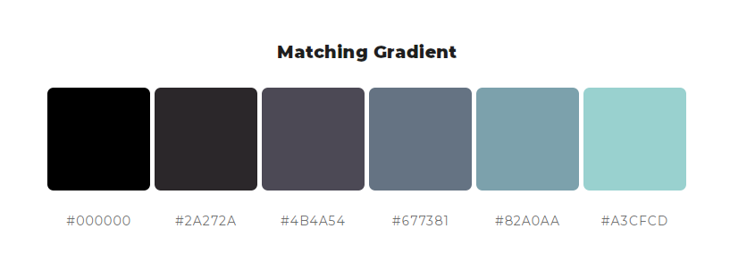

The website uses this matching gradient scheme, pulled from [ColorSpace](https://mycolor.space/?hex=%23000000&sub=1), and generated from #000 (black). I chose this option, as it has similarities to alpine blue rivers, which ties in with the theme of the website. Providing this consistency across all 4 pages, contributes to a positive user experience.

### Typography

I used Google Fonts for the following fonts:

- Roboto Condensed for all headings, and subheadings across the site. This is a sans-serif font.
- Roboto for the body text across the site. This is a sans-serif font.
- Shadow into Light for the ‘Paddle Adventures’ logo font. This is a cursive font.

### Imagery

All digital images, (excluding two images in the [credit](#media) section), were taken by myself. I converted these from jpeg to webp using [BIRME](https://www.birme.net/).
The logo image featuring a paddle outline, was created by myself using the ‘Paintbrush’ application on my laptop.

### Wireframes

Wireframes were created for mobile, tablet and desktop.

[Home Page - Desktop](docs/wireframes/home/home.png) |
[Home Page - Tablet](docs/wireframes/home/home_tablet_.png) |
[Home Page - Mobile](docs/wireframes/home/home_mobile.png)

[About Page - Desktop](docs/wireframes/about/about.png) |
[About Page - Tablet](docs/wireframes/about/about_tablet.png) |
[About Page - Mobile](docs/wireframes/about/about_mobile.png)

[Explore Page - Desktop](docs/wireframes/explore/explore.png) |
[Explore Page - Tablet](docs/wireframes/explore/explore_tablet.png) |
[Explore Page - Mobile](docs/wireframes/explore/explore_mobile.png)

[Sign Up Page - Desktop](docs/wireframes/sign-up/sign_up.png) |
[Sign Up Page - Tablet](docs/wireframes/sign-up/sign_up_tablet.png) |
[Sign Up Page - Mobile](docs/wireframes/sign-up/sign_up_mobile.png)

[Thank You Page - Desktop](docs/wireframes/thank-you/thank_you.png)|
[Thank You Page - Tablet](docs/wireframes/thank-you/thank_you_tablet.png) |
[Thank You Page - Mobile](docs/wireframes/thank-you/thank_you_mobile.png)

### Features

The website consists of five pages, four of which are accessible from the navigation menu throughout the website and logo in the header. A final thank you page is accessible once the user submits the sign up form.

*All pages on the website have:*

- A responsive navigation bar which includes the website logo “Paddle Adventures” and navigation links across the header from left to right as followed - Home, About, Explore, and Sign up!

- The logo is also encompassed within a link tag that navigates you back to the home page from each page. The logo is centered, and features a simple sketch of a kayak paddle to the left, creating a minimalistic, but striking look.

- Each navigation link will display a bottom border when you hover over it, mimicking an underline to signify what page the user is about to click on.

- On a screen size of less than 786px wide, the header remains in a sticky position at the top. This allows users on mobile and tablet devices to scroll down a page and access the navigation bar easily and immediately.

- The footer consists of a headline of “Follow us!”, followed by font awesome icons to 3 social media websites - Facebook, Instagram and Youtube. These icons are universally recognised and when clicked on, open up in a separate browser to the page. When hovered over, these links display the colour #82A0AA, keeping in theme with the matching gradient.

- Displayed on the far right is the copyright content in small font. On a mobile device the headline, social media links, and copyright content are stacked vertically and centered, so the footer doesn't appear cluttered and the links are easily displayed and accessible to the user.

*Home Page:*

- A Hero image of an Alpine River in the mountains is displayed across the screen with a central heading in the foreground. This image is fixed to the screen, allowing the user to scroll down and view more of the picturesque mountains and river below. A black background with a transparency of 0.5 is laid over the image so the heading is legible, but the image is still clear and appreciated.
  
- The second heading, 'Plan your adventure starting right here!', features a link over the word 'here' that takes the user directly to the About page. 'Here', also increases slightly in size when the user hovers their mouse over the word. This gives the user a positive experience as they are encouraged to start planning their holiday as they navigate through the website, following clear instructions.

- Directly below in the 'What We Do' section, another full width background image is featured with a translucent background of #82a0aa placed over it. (This colour also matches the social media links below, when hovered over). The text container colour is a dark shade of gray, #4B4A54, which is also used across all pages to box off information, keeping to a consistent theme colour.

- The information featured gives the user a brief overview of what the website provides and a link (represented with a font-awesome icon of a globe), to the sign up page as well. When hovered over, the globe changes from white to black to signify to the user where to click.

*About Page:*

- The about page consists of two summaries that lets the user know the benefits of paddling in France, and travel information.
'Getting there' includes a link to an external page for users to book a Ferry crossing. This helps the user with travel and booking logistics. The link is represented as a font-awesome icon of a ship, which when hovered over, changes from white to black.

- Two appealing images are featured adjacent to each summary, giving the user a visual idea of what to expect on a kayaking holiday.

*Explore Page:*

- This page contains two featured rivers, presented with a photo and summary of each river and what to expect. Each feature river layout displays an image of a river, adjacent to the information presented on it.
The text consists of the name, brief summary and informative links on the river. These include a 'Put in' and 'Take out' link that takes the user to an external page displaying maps with a pin, and a final link to youtube, so the user can watch POV videos of the rivers displayed. All links open on an external page so the user doesn't “get lost” navigating their way through the site.

- Below this, there are three equal sections inline with one another displaying information about where to visit, stay, and other nearby experiences. Each is accompanied with a photo and link to an external site with more information. These provide informative links for the user, pointing them out to helpful sources so they are able to structure and plan their holiday easily.

- The links provided are represented by font-awesome icons, giving a visual cue for the user to click on. Again, when hovered over, these turn from white to black.
The images under each heading here are also wrapped in these external links, allowing the user to quickly navigate to this page by simply clicking on the image.

*Sign Up:*

- This page consists of a full width image in the French Alps, with a form overlaid in the centre.
The form simply asks users to fill in a name, email, and password, in order to create an account for the 'online paddling community' with 'Paddler's adventures'. A quick note below these reassures the user that personal information is not shared with third parties.

- When the user hovers over the 'create account' button, the font switches to white, whilst the background colour switches to white. This provides a visual queue for the user to submit their details.

*Thank You Page:*

- When the user submits their details on the Sign Up page, this automatically navigates them to the Thank You page, with a simple message to the user thanking them, and then a prompt below, reminding the user to check their inbox for further instructions. This elicits a positive emotional response from the user, as they have successfully submitted their details without any issues.

- There is a further 'return to home' button below this information, to guide the user back to the index page.

*Future Implementations:*

- The long-term goal is to update the feature rivers regularly to entice returning users to check up on other rivers they may not have considered. This would also apply to the 'Explore more' section in the Explore page to advertise places to stay, visit, and experience. The aim behind this is to not only encourage returning users to try different things, but to support and promote local businesses within the area by having them featured on this site.

- The paddling-community will provide regular alerts that tell the user of new features on the Explore page, encouraging them to revisit the website. All previous features will remain in the paddling-community, so users can access this information at any time.

### Accessibility

I have ensure that this website is as accessible friendly as possible, I have done the following to achieve this:

- Used semantic HTML.
- Included aria-label for website navigation to describe to the screen reader where the user is being taken to.
- Used alt attributes to images in HTML to describe them.
- Used visually hidden text to describe background images in CSS, where an alt attribute cannot be supplied.
- Using the WebAIM colour contrast checker to ensure all body text is legible with sufficient contrast.
  
- - -

## Technologies Used

### Languages Used

HTML and CSS were used to create this website.

### Frameworks, Libraries & Programs Used

Pencil - Used to create wireframes.

Git - For version control.

Github - To save and store the files for the website.

Google Dev Tools - To troubleshoot and test various features, and solve issues with responsiveness and styling.

[Google Fonts](https://fonts.google.com/) - To import and use the fonts from the website.

[Font Awesome](https://fontawesome.com/) - For the iconography on the website.

[My Color Space](https://mycolor.space/) - To choose the colours used for the website.

[Contrast Checker](https://webaim.org/resources/contrastchecker/) - Ran tests on all text against background colour to ensure contrast checker past.

[RGBA to HEX converter](https://simplecss.eu/rgbatohex.html) - To convert RGBA to HEX to use Contrast Checker when required.

[BIRME](https://www.birme.net/) - To convert images from jpeg to webp images to improve lighthouse performance.

[TinyPNG](https://tinypng.com/) - To compress large image files on website.

[Am I Responsive](https://ui.dev/amiresponsive?url=https://clarar93.github.io/paddle-adventures/index.html) - To show the website on a range of devices.

[Flexbox Library](https://css-tricks.com/snippets/css/a-guide-to-flexbox/#aa-flexbox-tricks) - Used as a prompt and guidance for website structure and display.

- - -

## Deployment & Local Development

### Deployment

Github Pages was used to deploy the live website. The instructions are as followed:

1. Log in (sign up) to Github.
2. Search for this repository, paddle-adventures.
3. Navigate to the settings tab.
4. On the left hand menu click on the pages link.
5. In the source section, select main from the drop down menu under Branch.
6. Select root from the drop down folder and click save.
7. Your live Github pages site is now deployed at the following: [ClaraR93](https://clarar93.github.io/paddle-adventures/index.html)

### Local Development

#### How to Fork

To fork the paddle-adventures repository:

1. Go to the GitHub repository.
2. Click on Fork button in the upper right-hand corner.

#### How to Clone

To clone the paddle-adventures repository:

1. Log in (sign up) to Github.
2. Search for this repository, paddle-adventures.
3. Select the code button and choose whether you would like to clone with HTTPS, SSH or GitHub CLI and copy the link shown to your clipboard.
4. Open the terminal in your code editor and change the current working directory to the location you want to use for the cloned directory.
5. Type 'git clone' into the terminal and then paste the link you copied. Select enter.

- - -

## Testing

Testing was implemented throughout the entire build of this project. I used Chrome Developer tools to identify and troubleshoot problems along the way.

*The following issues were identified during my mid mentor meeting:*

1. It was pointed out to me by my mentor that the 'Paddler Adventures' logo placed on the far left on desktop screens, made the right hand side of the header appear empty. They suggested that I centre the logo across all screen devices to keep a consistent and tidy look.

2. When I ran my HTML code through the W3C validator, the following warnings were displayed across all background-images with aria-labels accompanying their div containers.

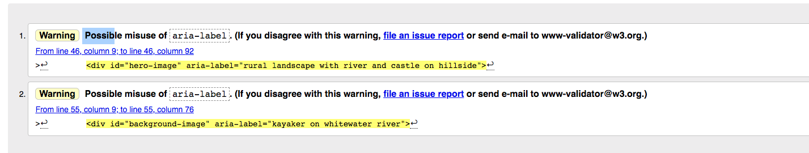

I spoke to my mentor about this during our meeting and they suggested the website [ADG](https://www.accessibility-developer-guide.com/knowledge/aria/bad-practices/) to help understand aria-labels more.
The page suggested using a visually hidden text approach, by adding a real text label, and hiding the element visually in CSS.
This rectified the issue, and created a working alternative for screen readers.

*The following suggestions were recommended when I submitted my site to peer code review on slack:*

1. Jennifer Willson kindly suggested adding a 'return to home page' button link to the thank you page, as it creates an instant and obvious instruction for the user.
2. She also suggested adding a custom 404 error page that puts the user at ease if they find themselves redirected to it.

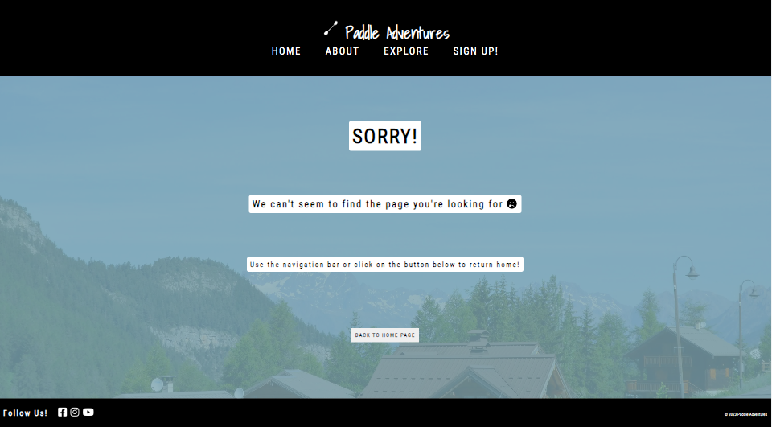

### W3C Validator

- [Home]()

- [About]()

- [Explore]()

- [Sign Up]()

- [Thank You]()

- [404]()

### Solved Bugs

- *Explore Page - Featured Rivers:*

- In my initial design, as shown in the desktop wireframe, the river section consisted of one row and three columns, each displaying an image and text description. When I constructed a rough plan on CSS consisting of six divs, the amount of information displayed in one row appeared too cluttered, which could overwhelm the user with information, and contribute to a bad user experience.

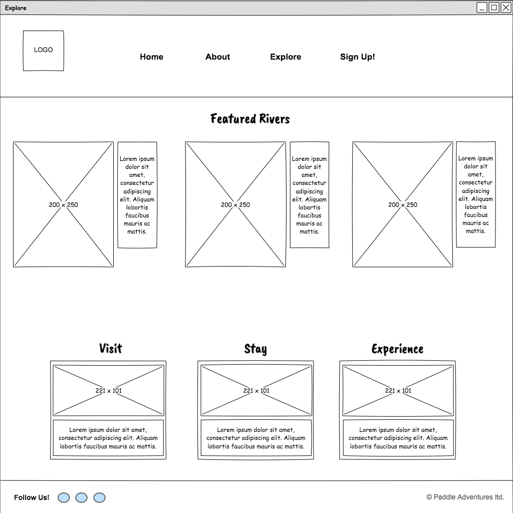

- As a solution I opted for a simpler design, displaying two featured rivers instead of three, and using flex-box to position both sections in separate rows and on opposite ends. This gave the page a more sleek and elegant look, making it easier for users to digest the information.

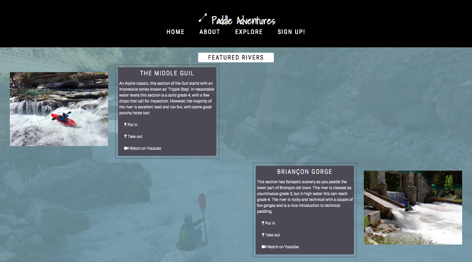

- *Colour scheme across website.*

- I originally decided on a very simple colour scheme of white text and black background, which worked really well for the header and footer elements, making them appear striking and memorable. However, when I set the section element background colour to black, testing what it would look like if the background images didn't load, it made the header and footer appear blended in, with no real structure to the page. This would result in a bad user experience, as the header and footer didn't look as bold and effective.

- As a solution, using My Color Space, I picked a matching gradient of #82A0AA for the midsection complimenting the header/footer elements and making each of these stand out.

- *Font change to paragraph elements:*

- Originally I kept the font consistent over all pages and elements, (excluding the logo), and this worked well for the headings. However, this appeared over-crowded in some of the paragraph content. To fix this, I decided to change the font here from 'Roboto Condensed' to 'Roboto', which made the information clearer and more legible to the user. Unfortunately, this resulted in some text-overflow, which I fixed by expanding the div container sizes, ensuring this was implemented in responsive design as well.

- *Hero image and image overlay on home page:*

- I found that Codeanywhere doesn't allow uploads of images over 1MB. So when I uploaded my chosen full width size images for the home page, I chose to adjust the image size to allow upload. Unfortunately, the image width was reduced to 1450px in order for it to scale down under 1MB. This limited the website to screen sizes below 1450px, as gaps would appear either side on larger monitors.
To fix this, I had heard about Tiny PNG through slack's channel #gitpod-and-codeanywhere, and compressed both images. I then resized the max width to a much larger size, ensuring they would maintain their full width on larger monitors.

- *Font Awesome icons in explore page:*

- On the 30th May 2023, the Font Awesome website was temporarily down, resulting in non-visible font awesome icons across the site. The video icon on the Explore page didn't have any text accompanying it, so if the user found themselves on this page if Font Awesome was down, the external links to videos wouldn't be visible to the user. This would result in limited user experience and navigation on the page. As a quick fix, I added a short description next to the video icon, 'Watch on Youtube, allowing users to be able to still navigate to youtube if font awesome is down.

- Furthermore, I went over all font awesome icons on each page and enclosed the external links around both the icon and adjacent description, keeping a consistent theme across the website.

- *Div containers in Explore Page:*

- When testing mobile responsiveness on the Explore Page, I noticed all the div containing text content were sticking out of the screen to the right. This would cause a bad user experience, as it looked visibly unappealing and made it look like the page wasn't running properly on mobile devices.

- After some investigation, using Chrome Developer tools, I removed the padding from the divs which fixed the issue. I then transferred the padding over to the paragraph elements to compensate for the initial loss of padding.

- *Mobile and small tablet scrolling:*

- When scrolling through pages on a tablet and mobile device, I found that I was spending a long time scrolling back up to the navigation bar, particularly on the Explore Page. This meant the user could easily get lost on a page, contributing to a poor user experience. I fixed this by changing the header position to sticky, so that it would always remain at the top of the user's screen on smaller devices when browsing through a page.
  
- *Mobile testing responsiveness on sign up page:*

- When I tested mobile responsiveness on the site in Chrome Developer Tools, there were no obvious issues. I decided to test this on my own mobile phone as well, to see how easy it was to navigate from a physical mobile device.
I noticed that on the sign up page the text input bars extended over to the right and outside the sign up form. This left the page looking glitchy and unprofessional.

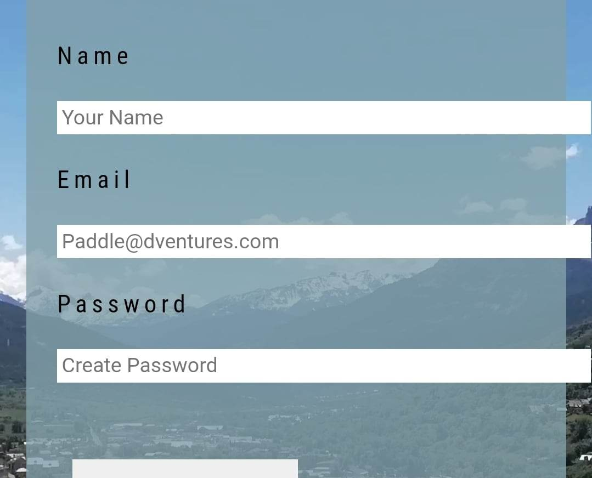

- Within CSS I added a width of 100% to the form in media queries under 400px, decreased the length of the text bars, and centered all the elements within the form. This fixed the issue and made the mobile page look tidy and legible to users.
  
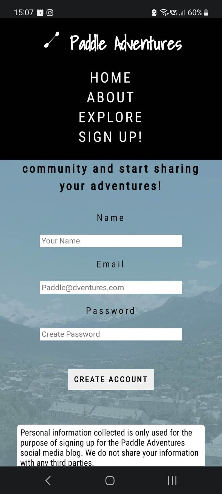

- *W3C HTML Validator for Thank You and 404 Page:*

- When I ran both these pages through the validator the following error was displayed, stating that the element button must not appear as a direct descendant of the anchor tag.

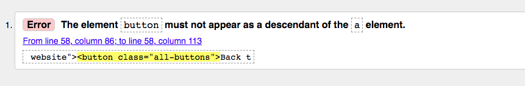

I did a quick google search on how to rectify the error and [stack overflow](https://stackoverflow.com/questions/24837102/the-element-button-must-not-appear-as-a-descendant-of-the-a-element) answers solved this for me; they prompted me to encompass the button in a form element rather than an anchor tag, resolving the issue.

### Testing User Stories

#### First Time Visitors

*I want to know where to start when planning my first paddling holiday.*

- A Guide to Paddling in the French Alps provides a starting point to planning your kayaking holiday, telling the user what they can provide on the Home page, and giving an overview on where to start in the About page. This is taken into further detail in the Explore page.

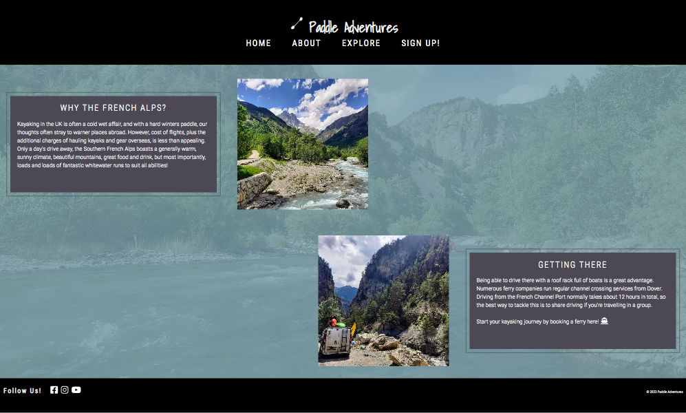

*I want to be greeted with visually exciting imagery that appeals to the adventurous paddler and explorer.*

- Each page on the website displays a full width background image, all featured within the French Alps, creating a visually pleasing experience for the user. The about and explore page feature additional images to compliment the information provided.

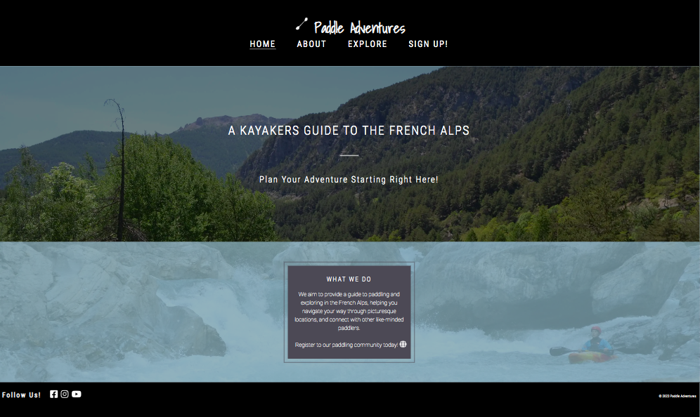

*I want to be able to navigate through the website with ease and find the information I require quickly.*

- All site navigation is featured in the header of every page, centered and in clear, contrasting text. On a mobile and tablet screen, the header remains in a sticky position at the top, allowing the user to scroll through information without losing the navigation bar.

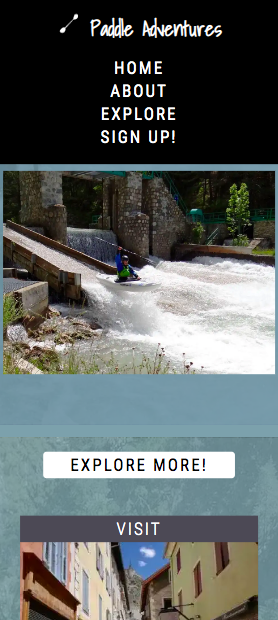

*I want to be able to easily navigate to external links provided that will give me further detailed information on how to plan my holiday.*

- External links are clearly mapped with some form of text description and a font-awesome icon that when hovered over, changes colour. Visually recognisable images that represent the links, accompanying the information, allows the user to easily navigate to further information on how to plan their holiday.

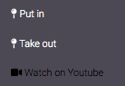

#### Returning Visitors

*I want to be able to sign up to the online paddling community to connect with others and share potential holiday adventures of my own.*

- The sign up page on the website provides a simple form that allows the user to register to an external paddling community. This allows them to connect with other like-minded people and share their own experiences abroad. Once form details are submitted, the user is greeted with a thank you page with brief instructions to show the user their details have gone through.

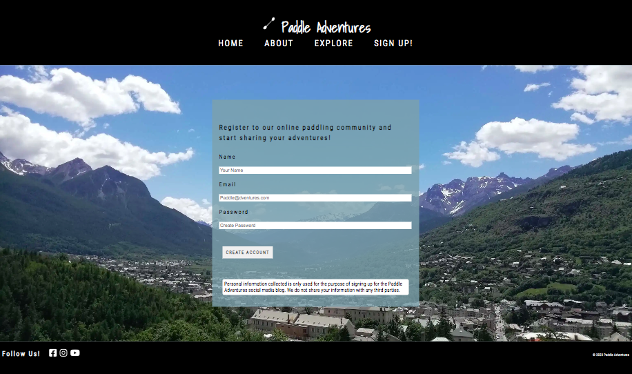

#### Frequent Visitor Goals

*I want to see regular updates to potential new places to paddle, places to visit, and things to do.*

- As mentioned in my future Implementations under [Features](#features), the explore page will display featured rivers and things to do, that will aim to get updated on a regular basis. This will entice users to regularly check the website for feature changes. They will also be notified by email alerts of any changes, after registering to the paddling-community.

### Lighthouse

I used Lighthouse in Chrome Developer tools so I could test the performance, accessibility, best practices and SEO of the website.

Home Page - Desktop:

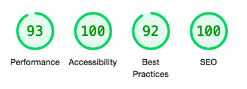

I was pretty happy with the initial lighthouse test results, but wanted to further improve Best Practice.

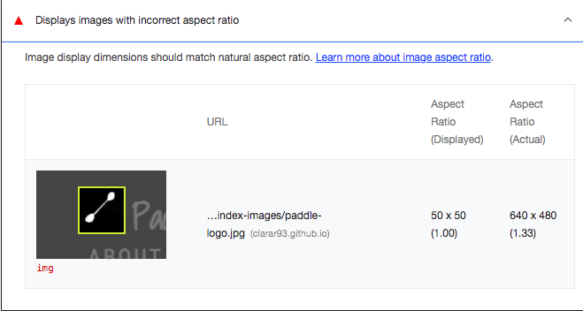

As shown in the image above, the paddle logo image could be resized to match the natural aspect ratio. I altered the width and height in CSS to resolve this and improve results.

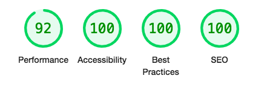

Home Page - Mobile:

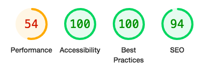

I was a little disappointed with the mobile lighthouse test results, in particular the performance. Chrome Developer Tools pointed out that 'a long cache lifetime can speed up repeat visits to your page'.
After researching ways to improve performance, I realized that this was beyond the scope of this project, as HTML and CSS alone cannot implement cache control.
I had also already converted large image files to webp to optimize performance as best as I could. Perhaps in the future with further knowledge, I will revisit this website and improve cache control.

#### Index Page

#### About Page

#### Explore Page

#### Sign Up Page

#### Thank You Page

### Full Testing

I tested my website on my MacBook Air (13-inch 2017) in Google Chrome and my Samsung A52 mobile phone.

I also tested responsiveness on all different screen sizes, using chrome developer tools.

Links:

1. Tested each link on the index page, including header and footer elements. Each link redirected to the correct page on the website, and any external links opened in a separate browser tab.
2. Tested each link on the about page, including header and footer elements. Each link redirected to the correct page on the website, and any external links opened in a separate browser tab.
3. Tested each link on the explore page, including header and footer elements. Each link redirected to the correct page on the website, and any external links opened in a separate browser tab.
4. Tested each link on the sign up page, including header and footer elements. Each link redirected to the correct page on the website, and any external links opened in a separate browser tab.
5. Tested each link on the thank you page, including header and footer elements. Each link redirected to the correct page on the website, and any external links opened in a separate browser tab.
6. Tested each link on the 404 error page, including header and footer elements. Each link redirected to the correct page on the website, and any external links opened in a separate browser tab.

Sign Up form

1. I tried to submit the form without filling any information in, and the form correctly prompted me to fill in my name. After filling in my name and attempting to submit again, the form prompted me to fill in my email address. I then filled in a valid email address and attempted to submit. The form correctly prompted me to fill in a password. After completing this, I hit submit, and the page redirected me to the thank you page as it's supposed to.

2. I tried to submit the form by filling in the email address, and the form prompted me to submit my name too. I filled this in and tried to submit again, the form prompted me to fill in my password. I submitted all three inputs and the page redirected me to the thank you page as it's supposed to.

3. I tried to submit the form by filling in the password only, and the form prompted me to submit my name too. I filled this in and submitted again, and the form prompted me to enter an email address. I submitted all three inputs and the page redirected me to the thank you page as it's supposed to.

4. I filled in all three inputs but put in an invalid email and tried to submit. The form prompted me to enter an @ symbol to proceed. I corrected this, submitted the form, and the page redirected me to the thank you page as it's supposed to.

- - -

## Credits

### Code Used

- [Visually hidden code to replace misuse of aria-label](https://www.accessibility-developer-guide.com/knowledge/aria/bad-practices/)

- [Form prompt used to encompass stand alone button in form element](https://stackoverflow.com/questions/24837102/the-element-button-must-not-appear-as-a-descendant-of-the-a-element)

### Content

- Content for the website was written by Clara Reynolds, with inspiration from the “White Water South Alps: 65 Classic Runs for Kayaking & Rafting in France, Italy & Switzerland” book, by Peter Knowles (Author), Ian Beecroft (Author).

- Clara Reynolds used her own experiences of visiting the French Alps several times in the past, implementing her own knowledge and guidance on where to paddle, places to visit and stay, and how to get there.

### Media

- The [background image](assets/images/about-images/about-background-image1.webp) on the about page, and the [via-ferrata image](assets/images/explore-images/via-feratta.webp) on the explore page were kindly sent over to me and given permission to use by a friend, Sam Fitzpatrick.

- All remaining photos were taken by Clara Reynolds.

### Acknowledgement

- Sheryl Goldberg - My code institute mentor.

- Jennifer Willson (Github) - For taking the time to peer review my website on slack and give feedback/suggestions.