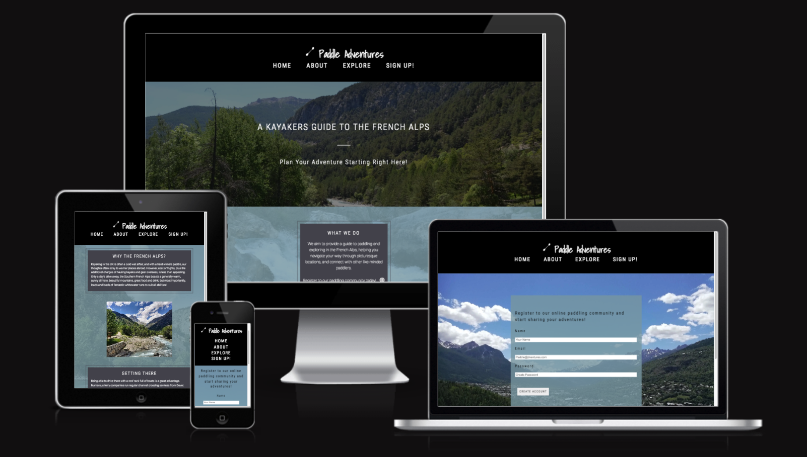

# A Kayakers Guide To The French Alps

The kayakers guide to the French Alps aims to inform and guide users who are looking to paddle abroad; more specifically in the French Alps. It aims to be responsive across a range of viewing devices.

[View A Kayakers Guide To The French Alps on Github](https://github.com/ClaraR93/paddle-adventures/)

## CONTENTS

* [User Experence (UX)]()
    * [Initial Discussion]()
    * [User Stories]()

* [Design]()
    * [Colour Scheme]()
    * [Typography]()
    * [Imagery]()
    * [Wireframes]()
    * [Features]()
    * [Accessibility]()

* [Technologies Used]()
    * [Languages Used]()
    * [Frameworks, Libraries & Programs Used]()

* [Deployment & Local Development]()
    * [Deployment]()
    * [Local Deplomyent]()
        * [How to Fork]()
        * [How to Clone]()

* [Testing]()
  * [W3C Validator]()
  * [Solved Bugs]()
  * [Known Bugs]()
  * [Testing User Stories]()
  * [Lighthouse]()
    * [Index Page]()
    * [About Page]()
    * [Explore Page]()
    * [Sign Up Page]()
    * [Thank You Page]()
* [Full Testing]()

* [Credits]()
  * [Code Used]()
  * [Content]()
  * [Media]()
  * [Acknowledgment]()
